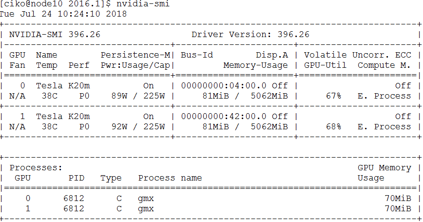

# Job Management
The cluster uses a dedicated job management system (software) that helps to organize users’ jobs. When a user requests specific resources (e.g. particular number of CPU cores or amount of memory) for the job, the management system finds and allocates resources and ensures exclusive access to them (the job does not overlap with other users’ jobs). Virtual queue is used to fairly divide cluster resources between jobs of many users. Job execution in the cluster has the following steps:
1.	Logging into the cluster
2.	Queuing a job
3.	Executing and monitoring a job
4.	Receiving the results

The job management system used in RTU cluster is Torque/Moab. Torque is a basic batch system, and Moab provides higher-level job scheduling and cluster management functionality.

---

## Queuing a Job
Before a job gets to a computing node and starts to execute, it is placed in a virtual queue. The queue organises resource allocation in a multi-user system where the number of jobs and their requirements may exceed the number of available resources (CPU, memory). When resources become available, usually the job waiting in the queue longer will be executed next. Users do not have to monitor the resource availability, job movement in the queue and execution is automatic. If there is no waiting jobs in a queue (meaning that the resources are available), then the job is started immediately.
### Simple Job
Jobs are queued using special Torque/Moab cluster user’s tools ([detailed documentation available online](https://support.adaptivecomputing.com/wp-content/uploads/2021/02/torque/torque.htm#topics/torque/2-jobs/submittingManagingJobs.htm)).
Command for submitting a simple job (batch script):
```
qsub test.sh
```
`test.sh` is a bash script with commands to execute when the job gets to a computing node. It ensures execution of a batch job without user’s participation. Examples of the batch scripts for launching various software applications on the cluster “Rudens” and other useful information can be found in the directory:  `/opt/exp_soft/user_info`.

### Interactive Job
Alternatively, an interactive job can be used instead of batch. The interactive mode is convenient for testing and debugging jobs or in case graphical tools are used. Start an interactive job:
```
qsub -I
```
Automatically a remote terminal on a computing node will be opened where a user can execute the needed commands by writing them in the command line. The command is similar to `ssh <hostname>`, with the difference that resources are reserved and there will not be any conflicts with other users.

If it is necessary to open a graphical window in an interactive regime, add -X parameter.
```
qsub -X -I
```

### Job requirements
Users can indicate the job parameters and requirements, like the name of the queue to be used or the time necessary for the job. This information will be used to find the most suitable resources for the job.
```
qsub –N my_job –q fast –l walltime=00:00:30 test.sh
```
You can add requirements at the beginning of the job script:
```
#!/bin/bash
#PBS -N my_job 			        ### Job name
#PBS -l walltime=00:00:30 	### Expected job maximum duration
#PBS -l nodes=1:ppn=1 		  ### Computing resources needed
#PBS -q fast 			          ### Queue
#PBS -j oe 		  ### Combine standard output and error in the same file
```
The requirements can be entered in either the command line or the script, but highest priority is given to the requirements in the command line in case they repeat.

How to request specific computing resources?  Define the requirements with qsub -l and indicate these parameters:
- number of cores: `-l procs=12`
- number of nodes and cores (use this notation for MPI jobs): `-l nodes=2:ppn=12`
- particular node (may result in more queue time):`-l nodes=wn62:ppn=64` or `-l nodes=wn02:ppn=18+wn03:ppn=18`
- use nodes only from the list: `-W x=HOSTLIST:wn02,wn03,wn04,wn05,wn06,wn07,wn08,wn09,wn10,wn11`
- number of GPUs: `-l nodes=1:ppn=12:gpus=2`
- necessary amount of memory (per CPU core): `-l nodes=1:ppn=12,pmem=1g`
- necessary amount of memory (for a job): `-l nodes=1:ppn=12,mem=12g`
- Require computing nodes with particular features. The features are usually used on clusters with non-homogeneous nodes. For example, to guarantee the job exaction on the latest generation nodes (with 36 CPU cores per node): `-l feature=vasara`

  {scale=80 align=center}

For full list of node names and features, please refer to the section HPC hardware specifications.

### Parallel (MPI) job
A job is divided between several cores in a node or between cluster nodes using Message Passing Interface (MPI) protocol. Queuing a parallel job requiring 24 cores (2 nodes × 12 cores in each node):
```
qsub -l nodes=2:ppn=12 run_mpi.sh
```
We advise to use OpenMPI versions which are pre-compiled for the cluster with Torque support.
```
module load mpi/openmpi-<version>
```
An example of `run_mpi.sh` script:
```
#!/bin/bash
#PBS -N my_mpi_job
#PBS -l walltime=00:00:30
#PBS -q batch
#PBS -j oe

#change directory to working directory
cd mpi_tests 	

#load OpenMPI module
module load mpi/openmpi/openmpi-default

#compile code with MPI C++ compiler
mpic++ MPItest.c -o MPItest.o

#execute program in parllel
mpirun -np 24 ./MPItest.o
```
MPI job examples can be found in the cluster directory: `/opt/exp_soft/users_info/mpi`

### Job variables
It is convenient to use variables in a job script that are set automatically when the job arrives on a computing node.
- `$PBS_O_WORKDIR` – the directory from which the job was submitted to queued
- `$PBS_NODEFILE`  ¬– list of the nodes reserved for the job
- `$PBS_GPUFILE`	– list of GPUs reserved for the task
- `$PBS_NUM_NODES` – number of nodes reserved for the job
- `$PBS_NUM_PPN` – reserved number of cores for each node
- `$PBS_NP` – the total number of cores reserved for the job
- `$PBS_JOBID` – job identifier

For example, to go to the directory from which the job was submitted: 
```
cd $PBS_O_WORKDIR
```
To get a list of all possible variables, start an interactive job (`qsub –I`) and execute the following command:
```
env | grep PBS
```

###	Cancelling a job
Running or waiting jobs can be cancelled by executing a command:
```
qdel <job_id>
```
or
```
canceljob <job_id>
```
<job_id> – unique identifier of a job.

Stop all user’s jobs:
```
qdel 'all'
```

---

## Job queues
There are several queues on the HPC cluster “Rudens”, which differ by the job duration and amount of available resources:
- **batch**: default queue which is suitable for tasks without specific requirements. Maximum job duration is up to 96 hours.
- **fast**: queue for short jobs (up to 8 h) with higher queue priority. Well suited for interactive and testing jobs. Only a single job per user can be in running state at a time.
- **long**: queue for time-consuming tasks (up to 2 weeks).
- **highmem**: queue to access high memory nodes: maximum 1,5 TB per core. The queue is available only after agreement with HPC centre.

Detailed description of the queues is available in Annex 1.  

Queue is selected with the `qsub –q <queue name>` parameter. If the queue is not specified, the job will be placed in the default queue “batch”.

---

## Monitoring queues, nodes, and jobs
Command to check the status of submitted jobs:
```
qstat
```
`R` – running, `C` – completed, `Q` - queued
To see all running jobs queued or running in cluster (for all users):
```
showq
```
Command to find out available computing resources:
```
showbf
```
Information about node availability:
```
nodes
```
For details about job execution, as well as the reasons for the job being held from execution in the queue:
```
checkjob <job_id> -vvv
```

---

## Job efficiency
It’s useful to track the resources that the job actually consumes. The reservation of multiple CPU cores or nodes does not yet guarantee that the job will efficiently use all allocated resources.

CPU usage efficiency for all user’s jobs in execution (command should be executed on login node).
```
showq –r –u <username>
```
{scale=80 align=center}

EFFIC column shows the average ratio (%) between the actual processor time and reserved one
- Optimal 70-100%;
- Below 50% – job uses allocated resources inefficiently – not all CPU cores are loaded or job mostly is waiting for slow input/output operations. Recommendation: Reduce the number of parallel processes;  
- Above 110% – not recommended; indicates using more CPU resources than reserved;

Local resource usage on a computing node:
1. Find out, on which node a job is running
    ```
    qstat -n <job_id>
    ```
    {scale=100 align=center}
    or
    ```
    showq -r -u $USER
    ```
    Let's assume the job is running on computing node wn01.
    
2. Connect with SSH to computing node wn01
    ```
    ssh wn01
    ```
    
3. Use Linux tools for monitoring:
    `htop`, `dstat`, `nvidia-smi`, `iostat`, `nfsstat`
    
    For example, the efficiency of CPU usage with command `htop`
    {scale=100 align=center}
    
    Track the GPU usage efficiency with command `nvidia-smi`
    {scale=100 align=center}    

---

## Best practices for the jobs with intensive input/output (I/O)
`/home/<username>` or `/home_beegfs/<username>` the user’s work directory and files are located on network attached disk array. Benefits: the directory is shared between all nodes, therefore it is easy to use it. Disadvantages: insufficient speed for many parallel I/O operations (working with a large number of small files, analysis of sequencing data, etc.).

`/scratch` Fast local SSD disk on a computing node.
- intended to be used only during job execution
- provides space up to 5.8 TB (depending on the node)
- requires manual copying of files to and from it
Users are encouraged to use the /scratch directory for data intensive jobs.

An example of using `/scratch` directory. Commands are executed on a computing node by using a batch script, or in an interactive mode.
```
SCRATCH=/scratch/$PBS_JOBID
mkdir –m 700 $SCRATCH
# copy data to scratch
cp $HOME/input_data $SCRATCH
# run program
./my_prog –input $SCRATCH/input_data –ouput $SCRATCH/output_data
# copy data back to home
cp –r $SCRATCH/output_data $HOME/
rm -rf $SCRATCH
```

Not all nodes are equipped with local SSD disks (SCRATCH), therefore please specify an appropriate feature parameter when you submit a job, for example, if a larger SCRATCH disk is required: 
```
#PBS -l feature=largescratch
```
{scale=80 align=center}

Multiple I/O-intensive user jobs or parallel processes on the same computing node can overload network storage and reduce job efficiency.
- To perform only 1 user task on each computing node, add the following job requirements:
  ```
  #PBS -W x=naccesspolicy:UNIQUEUSER
  ```
- Choose the optimal number of parallel processes (threads) – not necessarily a higher number means an increase in speed.

---

## Transition between Commands Torque/Pbs Pro and Slurm
Cheat sheet for those who have previously used the SLURM task management system (source: (https://openhpc.community/)[https://openhpc.community]).
{scale=80 align=center}

---
