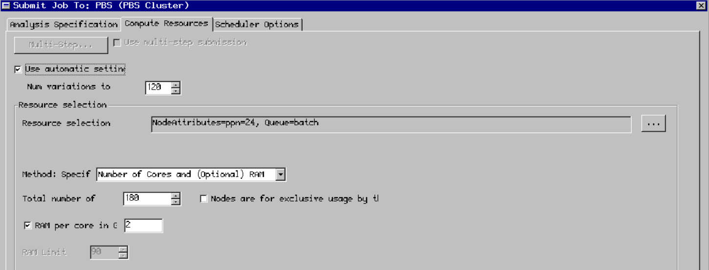
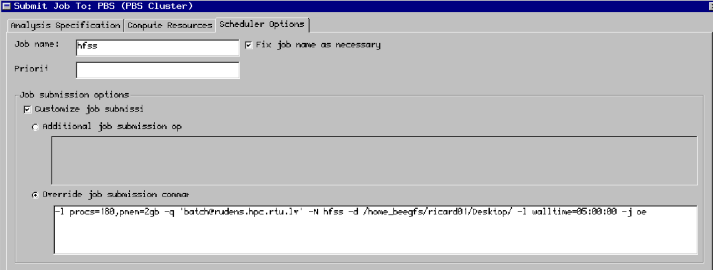

# ansys RSM setup(for ED see below)

## Prerequisites
Ansys RSM must be installed on your personal computer.
You need to be connected to the RTU network - either directly or indirectly through a VPN

## Connecting to the desktop environment
To launch ansys hfss you need to use x2go or a similar x11 forwarding program. Connect to the login node using the XFCE desktop environment setting in x2go.

## Launching a job from ansysHFSS
When you have opened ansysHFSS click the submit button in the <b>simulation</b> tab 


Next setup the simulation parameters as shown in the image and select the directory of the project that you want to simulate:


In the <b>compute resources</b> tab select the ammount of cores, ram and the number of variations to distribute:


In the <b>scheduler options</b> tab enter a custom job submission command. For example:
```
-l procs=180,pmem=2gb -q 'batch@rudens.hpc.rtu.lv' -N hfss -d /home_beegfs/<b>your user name</b>/ -l walltime=5:00:00 -j oe
```


Now just click <b>submit job</b> and everything should be running! 
