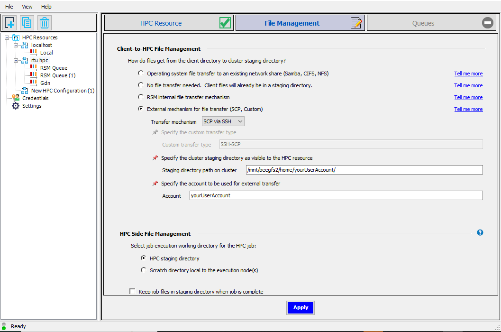
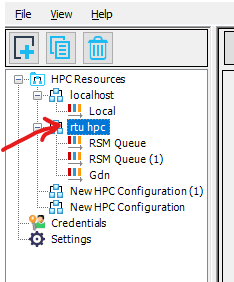

# ansys RSM setup
### For ansys Electronics Desktop see the other section "Using ansysHFFS on the cluster" in the guide

## Prerequisites
Ansys RSM must be installed on your personal computer.
You need to be connected to the RTU network - either directly or indirectly through a VPN

## Setting up RSM
Open ansysRSM on your machine. 

You should see the following screen. Press the button to add a new cluster(marked with a red arrow).

Now enter a name for the new cluster on the right side under the HPC configuration header. For the HPC type choose "**custom**". In the submit host enter "**ui-2.hpc.rtu.lv**". In the custom HPC type enter "**TORQUE**". Check the "**Use HPC protocol...**" checkbox and select "**Able to directly submit and monitor HPC jobs**". Lastly click **Apply** at the bottom.

In the second settings screen set everything as shown in the following image, but change the part "**yourUserAccount**" to your actual HPC account username. Click **Apply**.

First double click on the credentials tab on the left side then click the button on the right panel to create new credentials. 

In the promt that appears enter your HPC username and the password that you use to login to the HPC cluster

Select the cluster that you just created and any others where you wish to use this account.

Go back to the cluster setup by double clicking on the cluster name

Select the queues tab(1.). Then press the button(2.) to load the queues from the cluster. Check the queues that you will need to use in the **Enabled** column. Finally, test if the queues work by clicking the submit button(3.) and if everything is setup correctly you should see a green checkmark next to the submit button. Click **Apply**.

