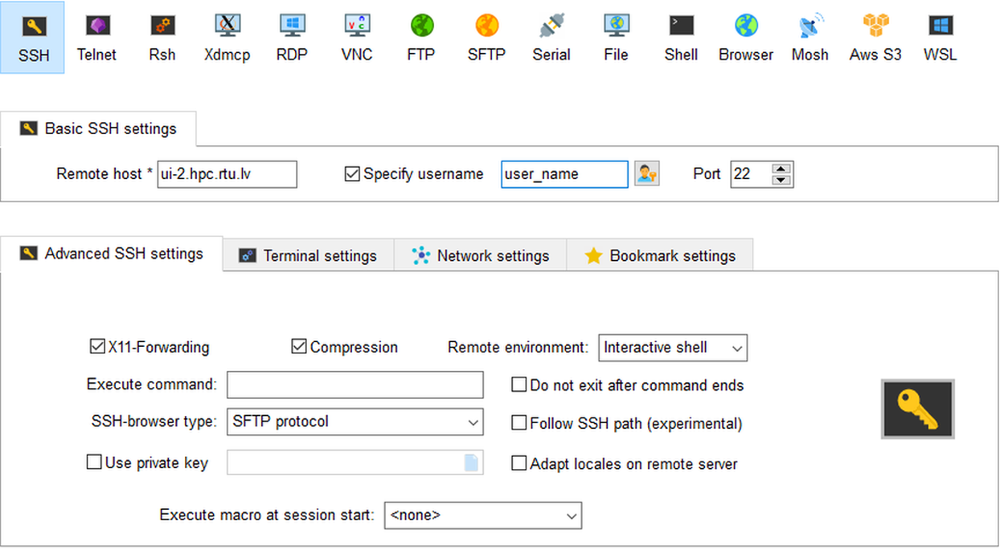
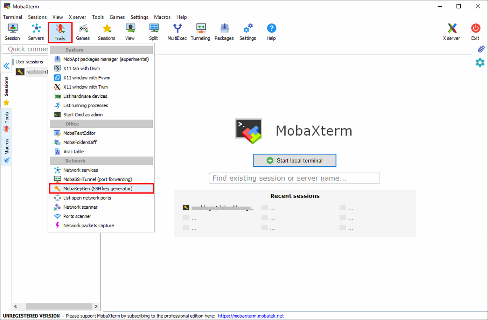
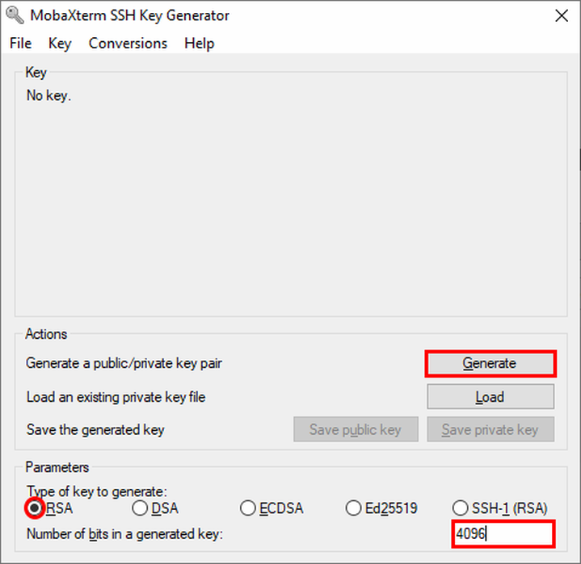

MobaXterm is a freeware that offers **enhanced terminal for Windows with X11 server, SSH clients and other network tools**. The personal home edition of MobaXterm can be downloaded from [http://mobaxterm.mobatek.net/download-home-edition.html](http://mobaxterm.mobatek.net/download-home-edition.html). The free personal edition supports **12 sessions**, which is sufficient for our use.

* Install and launch MobaXterm. When Windos Firewall prompted allow `xwin_mobax` only through private networks, and untick access via Public networks. Do not access these services from open networks.

* In a case of using portable version you need to setup right working directories: Settings => Configuration => General

* For Persistent root directory use MobaXterm install directory

* To create an `SSH` session, select `Session` and choose `SSH` in the `Session settings`. 

* Set remote host as `ui-2.hpc.rtu.lv`, tick `Specify user_name` and type your user_name in the box provided. Leave the port to be `22`. Be sure that you mark `Compression` box in `Advanced SSH settings`. This is quite important for slow connections. Click `OK`. 

* You should now be able to see `ui-2.hpc.rtu.lv(user_name)` in the Sessions tab. Select this session. This should prompt you for your password. This is your RTU HPC password.

* Make setting for X-Server (Settings => Configuration => X-server) like in a picture:

* Connect with SSH : Sessions => User Sessions => your’s session name

## Generating Keys on Windows using MobaXterm

There are multiple ways to generate SSH key pairs on a Windows system, and we present here  instructions for generation and use SSH keys on MobaXterm as our preferred tool for its user friendliness. The MobaXterm application includes a tool to help you generate SSH key pairs. Before starting, you should login to RTU HPC with MobaXterm using your account username and password. Once you are logged in: 

- Click on `Tools` and `MobaKeyGen (SSH key generator)`

In the section **Parameters** make sure to set the following properties:

- **Type of key to generate:** `RSA` (this is the `SSH-2` protocol)
- **Number of bits in a generated key:** `4096`
- Hit the `Generate` button.
- During generation, move the mouse cursor around in the blank area.

- When finished, **make sure to protect your generated key with a passphrase.** This passphrase is used for encrypting you private key to protect it against the private key file theft or being lost.
When using the key for login, you will have to enter it (or the first time you load it into the SSH key agent).
Note that when being asked for the **passphrase** this does not occur on the cluster but on your local computer.

- *Save the private and public key.* The default name under Linux for the **public key** is `id_rsa.pub` and `id_rsa` for the **private key**, but you can name them however you want (the `.pub` is NOT automatically added). 
Note that the **private key will be stored in Putty format** (`.ppk` extension is added automatically).

### Converting Putty (.ppk) key into the OpenSSH format 

- Click `Conversions` and select `Export OpenSSH key`.
Give the file the same name as your `.ppk` private key file above (just without the `.ppk`).

You should end up with three files:

- `id_rsa.pub`  This file yoy can paste into `~.ssh/authorized_keys` file on yours HPC account
- `id_rsa.ppk` This is your **private key** in **Putty** format
- `id_rsa` This your **private key** in **OpenSSH** format. 

### Import key in Windows MobaXterm

- Click `Settings` => `Configuration` => `SSH` tab

- Be sure to activate the 4 options :
   - SSH keepalive
   - Use Internal SSH Agent
   - Use External Pageant
   - Forward Agent
- Click on the **+** sign to import your private key (test_key.ppk in example ). It's also possible to import a key generated on linux or MacOS.

